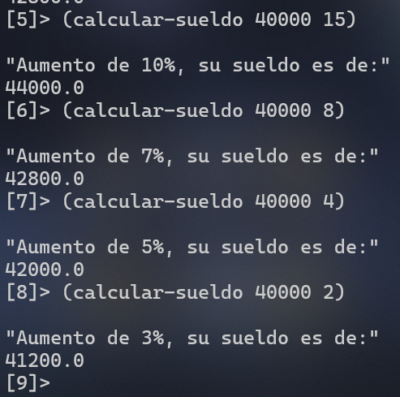
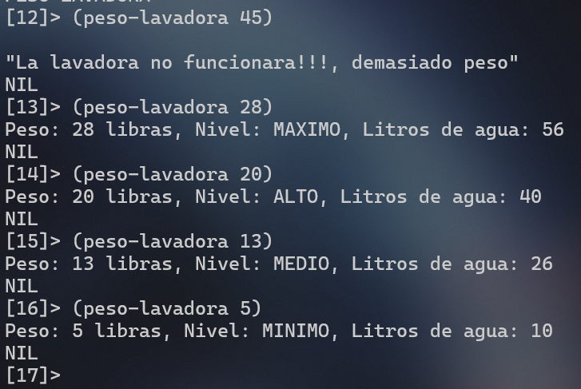
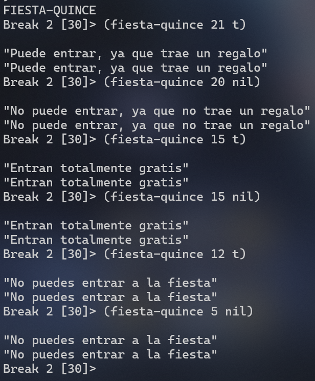

# 3 Ejercicios usando `if`, `when`, `unless`, `cond` y `case`

## 1. Calcular sueldo de Trabajador
Que calcule el sueldo que le corresponde al trabajador de una empresa que cobra 40.000 euros
anuales, el programa debe realizar los calculos en funcion de los siguientes criterios:
* Si lleva mas de 10 años en la empresa se le aplica un aumento del 10%
* Si lleva menos de 10 años pero mas que 5 se le aplica un aumento del 7%
* Si lleva menos de 5 años pero mas que 3 se le aplica un aumento del 5%
* Si lleva menos de 3 años se le aplica un aumento del 3%. 

```lisp
(defun calcular-sueldo (sueldo anios)

(if (>= anios 10)
(progn (print "Aumento de 10%, su sueldo es de:") (+ sueldo (* sueldo 0.1)))

    (if (>= anios 5)
    (progn (print "Aumento de 7%, su sueldo es de:") (+ sueldo (* sueldo 0.07)) )

        (if (> anios 3)
        (progn (print "Aumento de 5%, su sueldo es de:") (+ sueldo (* sueldo 0.05)))
            
            (if (>= anios 0)
            (progn (print "Aumento de 3%, su sueldo es de:") (+ sueldo (* sueldo 0.03)))
            
            (print "Error con año")
            )
         )
    )
)

)
```
Utilizamos if anidados haciendo rangos de comparacion entre el numero de años relacionado a cada aumento correspondiente.


* **Pruebas:**
<div align="center">
 
</div>  


## 2. Nivel de Peso de Lavadora
Hacer un algoritmo que tome el peso en libras de una cantidad de ropa a lavar en una
lavadora y nos devuelva el nivel dependiendo del peso; ademas nos informa la cantidad de
litros de agua que necesitamos.
- Se sabe que con mas de 30 libras la lavadora no funcionara ya que es demasiado peso.
- Si la ropa pesa 22 o mas libras, el nivel sera de maximo
- si pesa 15 o mas el nivel sera de alto
- si pesa 8 o mas sera un nivel medio
- o de lo contrario el nivel sera minimo

```lisp
(defun peso-lavadora (peso)

(when (> peso 30)
    (print "La lavadora no funcionara: demasiado peso")
    (return-from peso-lavadora nil))

(unless (> peso 0)
    (print "Error: El peso debe ser mayor a 0 libras")
    (return-from peso-lavadora nil))

; nivel (cond para verificar pesos) y litros (en base al nivel)
(let ((nivel (cond 
                  ((>= peso 22) 'maximo)
                  ((>= peso 15) 'alto)
                  ((>= peso 8)  'medio)
                  (t 'minimo)))
         (litros (* peso 2))) ; 2 litros de agura por cada libra de ropa

    (if (and nivel litros)
        (format t "Peso: ~a libras, Nivel: ~a, Litros de agua: ~a~%"
                        peso              nivel              litros)
    )
)
)
```

Creamos dos variables (nivel y litros), en la funcion empezamos con un when y unless para filtrar el caso donde no funcionaria la lavadora, para despues asignarle un valor de Maximo, Alto, Medio o Minimo a la variable nivel dependiendo del peso que se ingrese.

Despues se le asigna a la variable litros el valor de 2 litros de agua por cada libra de ropa ingresada.

Y al final se hace una condicional si ambas variables tienen datos, se imprimen las variables de peso, nivel y litros.

* **Pruebas:**
<div align="center">
 
</div>  


## 3. Fiesta de Quince
Martha va a realizar su fiesta de quince años. Por lo cual ha invitado a una gran cantidad de personas. Pero tambien ha decidido algunas reglas:
* Que todas las personas con edades mayores a los quince años; solo pueden entrar si traen regalos
* Que jovenes con los quince años cumplidos; entran totalmente gratis 
* Pero los de menos de quince años no pueden entrar a la fiesta
Hacer un algoritmo donde se tome la edad de una persona y que requisito de los anteriores le toca cumplir si quiere entrar.

```lisp
(defun fiesta-quince (edad regalo)
    (cond 
        ((< edad 15) (print "No puedes entrar a la fiesta"))
        ((= edad 15) (print "Entran totalmente gratis"))
        ((> edad 15)
         (if regalo
                (print "Puede entrar, ya que trae un regalo")
                (print "No puede entrar, ya que no trae un regalo"))
        )
        (t (print "Error de edad/regalo"))
    )
)
```

Condicional simple para dar de resultado una respuesta rapida dependiendo de la edad.

* **Pruebas:**
<div align="center">
 
</div>  