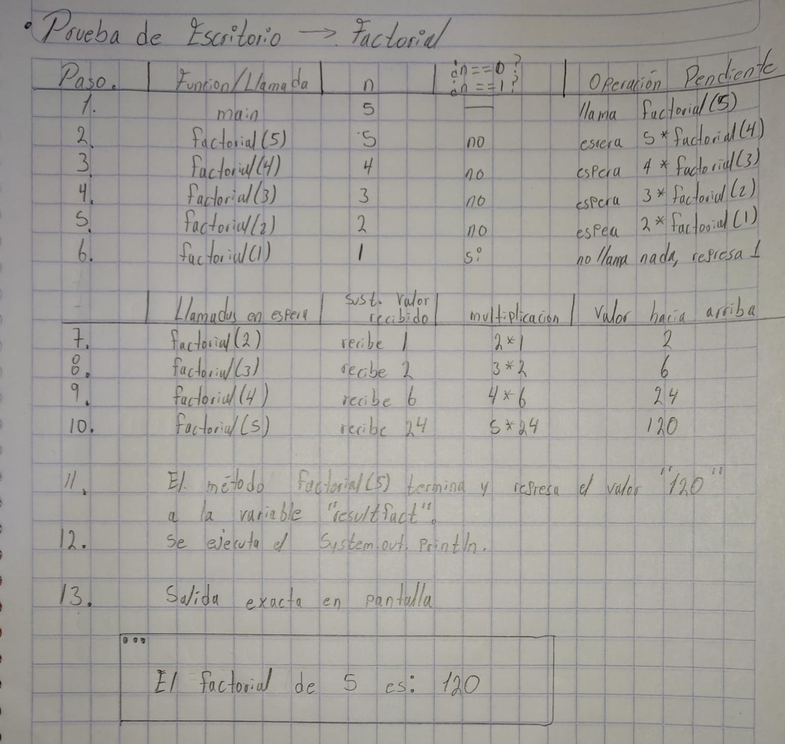
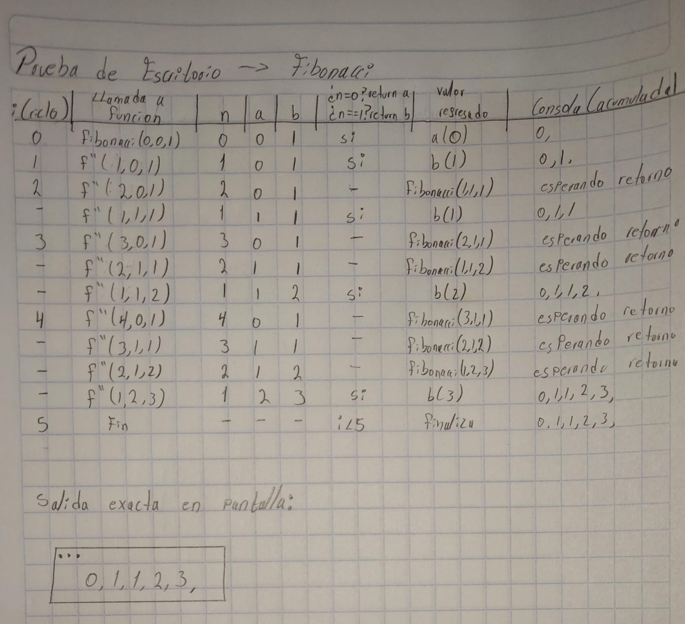
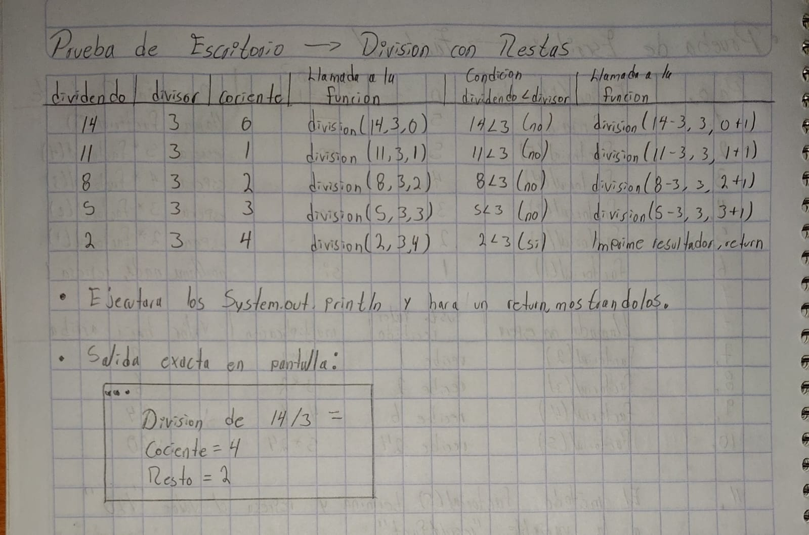

# Actividad. 3 funciones recursivas + Prueba de escritorio

- ## Factorial
- ## Fibonacci
- ## División con restas sucesivas

# Factorial
El factorial de un numero se saca multiplicando ese numero por todos los anteriores hasta llegar al 1 (por ejemplo: 5! = 5 * 4 * 3 * 2 * 1)
* **Caso base:**
  - Si el numero llega a ser 0 o 1, la funcion se detiene y regresa un `1`.
  - Si regresaramos `0`, toda la multiplicación se borraria y daria cero.
* **funcionalidad  recursiva:** Si no es 0 ni 1, deja pendiente la multiplicación `n * factorial(n - 1)` hasta que la siguiente funcion le responda.

```java
public class Actividad3Factorial {

    public static void main(String[] args) {

        /*factorial: n! = (n-0)*(n - 1)*(n - 2)... */
        int numero = 5;

        int resultfact = factorial(numero);
        System.out.println("El factorial de " + numero + " es: " + resultfact);

    }

    public static int factorial(int n) {
        if (n == 0 || n == 1) {
            return 1;
        }
        return n * factorial(n - 1);
    }

}
```

## Prueba de Escritorio - Factorial



# Fibonacci
En la serie de Fibonacci cada numero es la suma de los dos anteriores: 0, 1, 1, 2, 3, 5...
Normalmente este codigo de manera recursiva se abre en forma de arbol y hace muchas llamadas repetidas, sin embargo, se muesra una forma lineal y eficiente, donde en cada llamada pasamos los dos numeros que llevamos (a y b) y avanza de forma lineal en bucle 

- **Caso base:** Cuando el contador n llega a 0 regresa a, y cuando llega a 1 regresa b
- **funcionalidad recursiva:**
  - Le restamos 1 a n para contar las vueltas
  - El valor de b pasa a ser el nuevo a
  - Y el nuevo b es la suma de los dos (a + b)

```java
public class Actividad3Fibonacci {

    public static void main(String[] args) {

        int cantidadN = 5;
        for (int i = 0; i < cantidadN; i++) {
            System.out.print(fibonacci(i, 0, 1) + ", ");
        }

    }

    public static int fibonacci(int n, int a, int b) {
        if (n == 0) { return a; }
        if (n == 1) { return b; }
        return fibonacci(n - 1, b, a + b);
        /*
        if (n <= 1) { //si n es 0 o 1 devuelve el mismo numero
            return n;
        }
        return fibonacci(n - 1) + fibonacci(n - 2);
        */
    }
}
```
## Prueba de Escritorio - Fibonacci



# Division con Restas sucesivas
En la division tiene como resultado el cuantas veces le puedes restar un numero a otro. Por ejemplo, en **14/3** le vamos quitando de 3 en 3 al 14 y contamos con una variable para ver cuantas restas pudimos hacer.
- **Caso base:** Cuando lo que nos queda en el dividendo ya es menor que el divisor (ya no alcanza para restar otra vez):
  -  Imprimimos el cociente (las veces que restamos) y el resto (lo que sobro), y nos salimos con un return
- **funcionalidad recursiva:** Le restamos el divisor al dividendo (dividendo - divisor) y le sumamos 1 a nuestro contador (cociente + 1)

```java
public class Actividad3DIvisionRestas {

    public static void main(String[] args) {
        int dividendo = 14;
        int divisor = 3;

        System.out.println("Division de "+dividendo+"/"+divisor+" = ");
        division(dividendo, divisor, 0);
    }

    public static void division(int dividendo, int divisor, int cociente) {
        if (dividendo < divisor) {//hasta que ya no se pueda restar mas
            System.out.println("Cociente: " + cociente);
            System.out.println("Resto:    " + dividendo);
            return;
        }

        division(dividendo - divisor, divisor, cociente + 1);
    }
}
```
## Prueba de Escritorio - Division con Restas sucesivas
