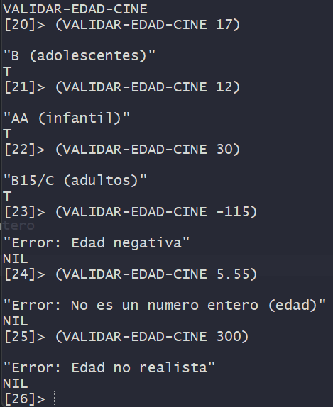
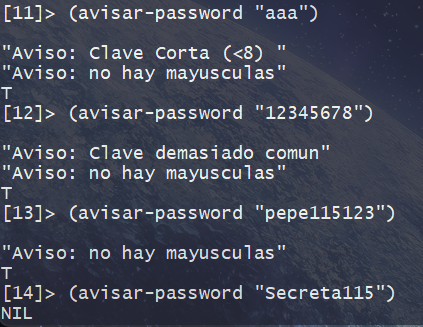
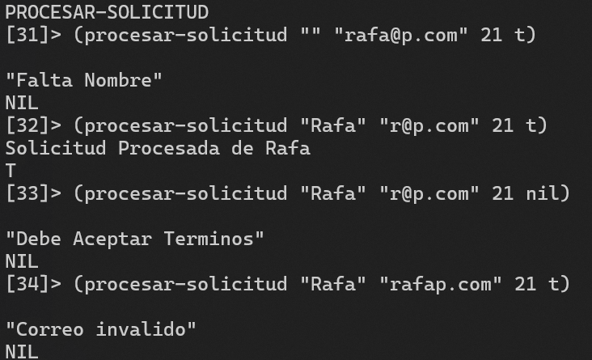
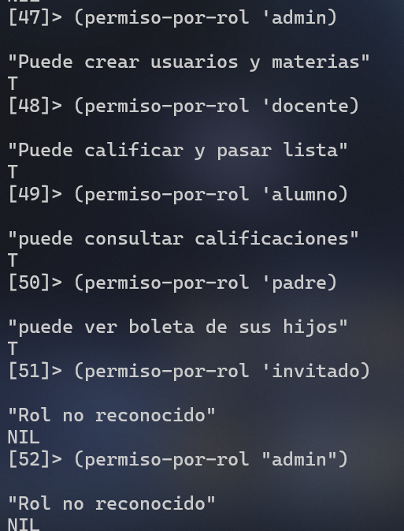
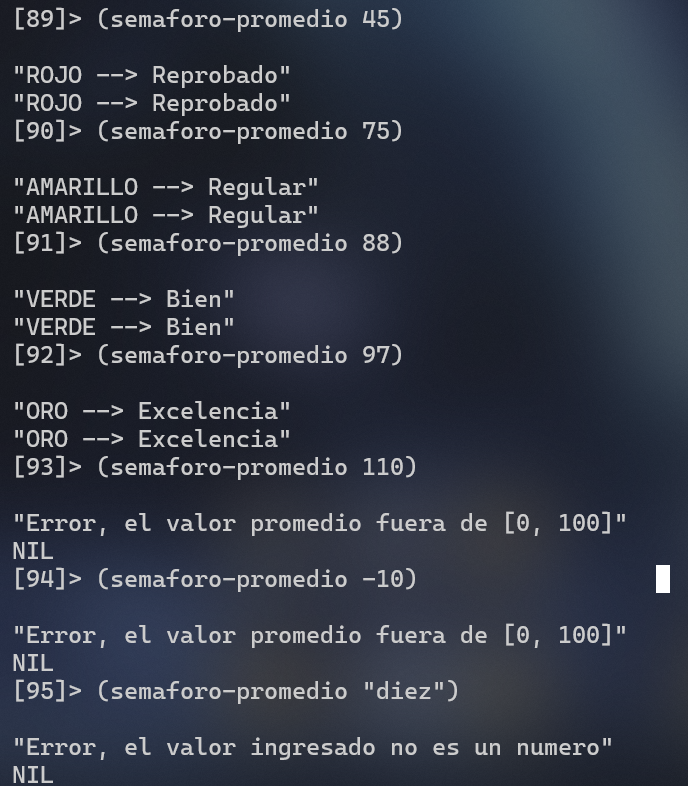
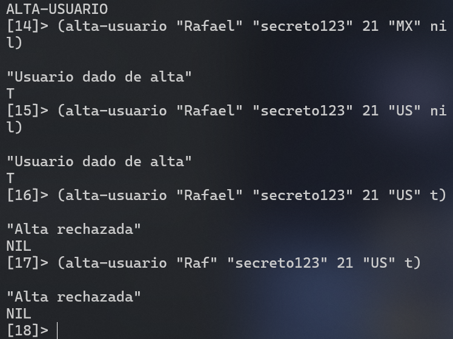
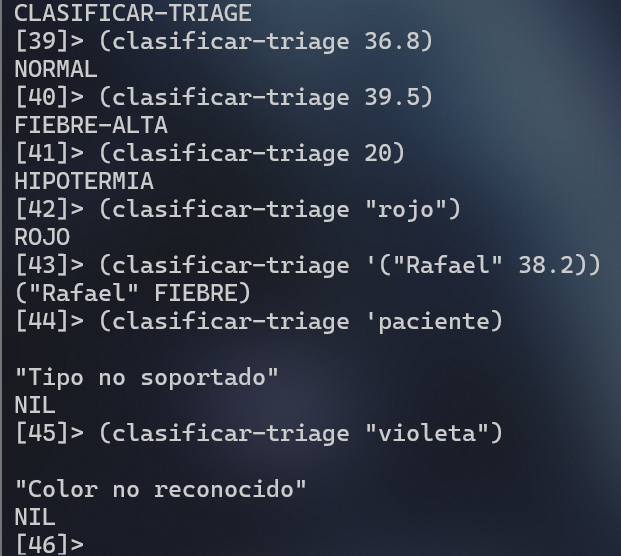

# 10 Ejercicios de Validación en CLIPS (if, when, unless, case)

Estos ejercicios practican validación de datos en CLIPS (C Language Integrated Production System) con constructos condicionales: if, when, unless, switch/case, más and, or y not.

---

## Mapa de Constructos

| Constructo | Equivalente real en CLISP | Cuando usarlo |
| --- | --- | --- |
| if / then / else | (if cond then ... else ...) | Dos caminos (valido / invalido, si / no) |
| when | (if cond then ...) sin else | Solo actuar si la condicion se cumple |
| unless | (if (not cond) then ...) | solo actuar si no se cumple (guardar / rechazo) |
| case | (switch expr (case v then ...) (default ...)) | Distinguir valores discretos (roles, codigos) |
| and / or / not | funciones booleanas de CLISP | Combinar varias validaciones |

## SIntaxis (if, when, unless, case)

```lisp
;; if: la forma es (if test entonces [si-no])
(if (>= edad 18)
    (print "adulto")
    (print "menor"))

;; when: cero o más expresiones en el cuerpo; si el test falla, no hace nada
(when (< (length clave) 8)
  (format t "Aviso: clave corta~%")
  (incf *avisos*))

;; unless: el cuerpo corre cuando el test es NIL
(unless (search "@" correo)
  (return-from validar (reportar-error "Correo sin @")))

;; case: compara con EQL (símbolos, enteros, caracteres). NO uses case con strings.
(case rol
  (admin   "acceso total")
  (docente "puede calificar")
  (alumno  "solo consulta")
  (otherwise "rol desconocido"))
```

## Como ejecutar en terminal
```lisp
cd "/cygdrive/c/Users/Rafa115/Downloads/carpeta de pruebas/Programacion Logica y Funcional/Programacion_Logica_y_Funcional_I/Trabajo9"

clips

CLIPS> (load "validaciones.clp")
CLIPS> (reset)
CLIPS> (run)
```

---

# Ejercicios

---

## Ejercicio 1 — `if`: edad para cine

**Objetivo**: Usar if (anidado si hace falta) para validar un entero y clasificar.

**Enunciado**: Escribe (defun validar-edad-cine (edad) ...)

* **Reglas:**
  * Si edad no es entero → error "La edad debe ser un entero".
  * Si edad < 0 → error "Edad negativa".
  * Si edad > 120 → error "Edad no realista".
  * Si edad < 13 → ok "AA (infantil)".
  * Si edad < 18 → ok "B (adolescentes)".
  * En otro caso → ok "B15/C (adultos)".
  * Pistas: integerp, if, predicados < / > / >.

* **Pruebas mínimas**
  * (validar-edad-cine 10)     ; AA
  * (validar-edad-cine 16)     ; B
  * (validar-edad-cine 21)     ; adultos
  * (validar-edad-cine -3)     ; error
  * (validar-edad-cine 200)    ; error
  * (validar-edad-cine 17.5)   ; error (no entero)

**Criterio**: En este ejercicio solo if. Nada de cond ni case. Debe devolver T o NIL.

```lisp
(defun validar-edad-cine (edad)
  (if (integerp edad)
      (if (< edad 0)
      (progn (print "Error: Edad negativa") nil) ;true
      (if (> edad 120) ;false
          (progn (print "Error: Edad no realista") nil) ; true
          (if (< edad 13) ;false
              (progn (print "AA (infantil)") t) ;true
              (if (< edad 18)
                  (progn (print "B (adolescentes)") t) ;true
                  (progn (print "B15/C (adultos)") t)
              )
          )
      )
  )
     (progn (print "Error: No es un numero entero (edad)") nil); No es entero
  ) 
)
```

* **Pruebas:**
<div align="center">
 
</div>   

---


* ## Ejercicio 2 — `when`: avisos, no bloqueos


**Objetivo**: when no rechaza: solo avisa si hay un riesgo. El cuerpo puede tener varias líneas.

**Enunciado**: Escribe (defun avisar-password (clave) ...)

La función siempre devuelve T (es un aviso, no un validador estricto), pero:
* when ( < (length clave) 8 ) → "Aviso: clave corta (< 8)"
* when la clave es "12345678" o "password" (usa or y string=) → "Aviso: clave demasiado común"
* when la clave es igual a su versión en minúsculas y no está vacía → "Aviso: no hay mayúsculas" Pista: (string clave (string-downcase clave))=
* Tres when independientes. Prohibido un if con rama else que rechace.

**Pruebas mínimas**
* (avisar-password "abc")
* (avisar-password "password")
* (avisar-password "Secreta99")

**Criterio**: Si pusiste un else que devuelve NIL, estás haciendo un if de validador: reescríbelo como avisos.


```lisp
(defun avisar-password (clave)

;longitud menor a 8
(when (< (length clave) 8)
(progn (print "Aviso: Clave Corta (<8) ") T)
)

;contraseñas comunes
(when (or (String= clave "12345678")(String= clave "password"))
(progn (print "Aviso: Clave demasiado comun") T)
)

;minusculas y no vacia
(when (and (not(String= clave "")) (string= clave (string-downcase clave)))
(progn (print "Aviso: no hay mayusculas") t)
)

)
```

* **Pruebas:**
<div align="center">
 
</div>   

---


* ## Ejercicio 3 — `unless`: no procesar si faltan datos

**Objetivo**: unless es un guardián: «a menos que el dato esté bien, ni sigas». Combina bien con return-from.

**Enunciado**: Escribe (defun procesar-solicitud (nombre correo edad acepta-terminos) ...)

**Comportamiento, en este orden:**
* unless el nombre es un string no vacío → error "Falta nombre" y NIL.
* unless el correo es string y contiene "@" → error "Correo inválido" y NIL. Pista: (search "@" correo) devuelve NIL si no hay arroba.
* unless acepta-terminos es verdadero → error "Debe aceptar términos" y NIL.
* Si pasó los tres guardianes → ok "Solicitud de <nombre> procesada" y T.


**Cada guarda se escribe con unless, no con una torre de if/else.**

(defun procesar-solicitud (nombre correo edad acepta-terminos)
  (declare (ignore edad))
  (unless ...
    (return-from procesar-solicitud (reportar-error "...")))
  ;; ...
  )


**Pruebas mínimas**
* (procesar-solicitud "" "a@b.com" 20 t)
* (procesar-solicitud "Ana" "ana.b.com" 20 t)
* (procesar-solicitud "Ana" "ana@b.com" 20 nil)
* (procesar-solicitud "Ana" "ana@b.com" 20 t)

**Criterio**: El camino feliz queda al final, al ras, no escondido en el else de 4 niveles.


```lisp
(defun procesar-solicitud (nombre correo edad acepta-terminos)
;con esto se ignora a edad
(declare (ignore edad))

; si la cadena es un string, y no esta vacia
(unless (and (stringp nombre)(>(length nombre) 0)) 
(print "Falta Nombre") ; nil
(return-from procesar-solicitud ) ; T
)

; si el correo es un string y tiene "@"
(unless (and (Stringp correo)(search "@" correo))
(print "Correo invalido") ; nil
(return-from procesar-solicitud) ; T
)

; si acepta "T" o rechaza "nil" los terminos
(unless acepta-terminos 
(print "Debe Aceptar Terminos") ; nil
(return-from procesar-solicitud ) ; T
)

(format t "Solicitud Procesada de ~a" nombre) t ; T
)
```

* **Pruebas:**
<div align="center">
 
</div>   

---


* ## Ejercicio 4 — `case`: roles de un sistema escolar

**Objetivo**: Validar un símbolo discreto con case. case compara con eql, por eso el rol debe ser un símbolo, no un string.

**Enunciado**: Escribe (defun permiso-por-rol (rol) ...)

|   rol  | mensaje    |  retorno   |
|-----|-----|-----|
|  admin   |  Puede crear usuarios y materias   |  T   |
|  docente   |  Puede calificar y pasar lista   |  T   |
|   alumno  | Puede consultar calificaciones    |  T   |
|  padre   |  Puede ver boleta de sus hijos   |   T  |
|  otro   |  Rol no reconocido   |  NIL   |

Usa otherwise (o t) para el caso por defecto.

**Pruebas mínimas**
* (permiso-por-rol 'admin)
* (permiso-por-rol 'docente)
* (permiso-por-rol 'invitado)
* (permiso-por-rol "admin")   ; debe fallar: string no es eql al símbolo admin

**Criterio**: Cero if en esta función. Solo case. Si alguien pasa el string "admin", el otherwise lo rechaza: eso es correcto y hay que documentarlo en un comentario de una línea.

```lisp
; (permiso-por-rol "admin")   ; debe fallar: string no es eql al símbolo admin
(defun permiso-por-rol (rol)
  (case rol
    (admin (print "Puede crear usuarios y materias") t)
    (docente (print "Puede calificar y pasar lista") t)
    (alumno (print "puede consultar calificaciones") t)
    (padre (print "puede ver boleta de sus hijos") t)
    (t (print "Rol no reconocido") nil)
  )
)
```

* **Pruebas:**
<div align="center">
 
</div>   


---


* ## Ejercicio 5 — `cond`: semáforo de promedio

**Objetivo**: case no sirve para rangos (< 60, < 80=…). Ahí entra =cond: la primera cláusula verdadera gana.

**Enunciado**: Escribe (defun semaforo-promedio (p) ...)

* Validación previa con unless (sí se permite, antes del cond):
  * unless (numberp p) → error
  * unless p está en [0, 100] → error "Promedio fuera de [0, 100]"

* Luego el cond:
  * Condición	Color	Significado
  * (< p 60)	ROJO	Reprobado
  * (< p 80)	AMARILLO	Regular
  * (< p 90)	VERDE	Bien
  * t (resto)	ORO	Excelencia
  * Devuelve T si el dato era válido (aunque el alumno esté reprobado). El color va en el mensaje.

**Pruebas mínimas**
* (semaforo-promedio 45)
* (semaforo-promedio 75)
* (semaforo-promedio 88)
* (semaforo-promedio 97)
* (semaforo-promedio 110)
* (semaforo-promedio "nueve")

**Criterio**: El color no puede decidirse con if anidados ni con case. El orden de las cláusulas de cond importa.

```lisp
(defun semaforo-promedio (p)

(unless (numberp p)
    (print "Error, el valor ingresado no es un numero") ;nil
    (return-from semaforo-promedio) ;T
)
(unless (and (>= p 0) (<= p 100))
    (print "Error, el valor promedio fuera de [0, 100]") ;nil
    (return-from semaforo-promedio) ; T
)

; la primera verdadera, gana
(cond ((< p 60) (print "ROJO --> Reprobado"))
      ((< p 80) (print "AMARILLO --> Regular"))
      ((< p 90) (print "VERDE --> Bien"))
      (t (print "ORO --> Excelencia"))
)
      
)
```

* **Pruebas:**
<div align="center">
 
</div>   

---


* ## Ejercicio 6 — `and` / `or` / `not` + `if`: alta de usuario

**Objetivo**:Combinar varias condiciones en una expresión, no en cinco if sueltos.

**Enunciado**: Escribe (defun alta-usuario (user pass edad pais bloqueado) ...)

* Aceptar (T) solo si se cumplen todas:
  * (> (length user) 4)= y user es string
  * (> (length pass) 8)= y pass es string
  * (> edad 13)=
  * pais es "MX" o "CO" o "AR" (usa or y string=)
  * bloqueado no es verdadero (usa not)

* Un solo if principal:
(if (and ...)
    (reportar-ok "Usuario dado de alta")
    (reportar-error "Alta rechazada"))
Extra (opcional): si falla, con when encadenados indica cuál condición falló.

**Pruebas mínimas**
* (alta-usuario "ana" "secreto1" 20 "MX" nil)   ; ok
* (alta-usuario "ana" "secreto1" 20 "US" nil)   ; país
* (alta-usuario "ana" "secreto1" 20 "MX" t)     ; bloqueado
* (alta-usuario "an"  "secreto1" 20 "MX" nil)   ; user corto

**Criterio**: La decisión final vive en un (and ...). Prohibido un if anidado de 5 niveles para decidir el T=/ =NIL.

```lisp
;(and (condicion-1)
;     (condicion-2)
;     (condicion-3)
;     (condicion-4)
;     (condicion-5))

(defun alta-usuario (user pass edad pais bloqueado)

(if (and (and (stringp user) (>(length user) 4)) ;user es string y tiene mas de 4 caracteres
         (and (stringp pass) (> (length pass) 8)) ;pass es string y tiene mas de 8 caracteres
         (and (numberp edad) (> edad 13)) ;la edad es mayor a 13
         (and (stringp pais) (or (string= pais "MX") (string= pais "US") (string= pais "CO") (string= pais "AR")))
         (not bloqueado) ; si esta bloqueado; nil es T, T es nil: todo el if da de alta si es T
    )
(progn (print "Usuario dado de alta") t)
(progn (print "Alta rechazada") nil)
)

)
```

* **Pruebas:**
<div align="center">
 
</div>   

---


* ## Ejercicio 7 — `typecase`: triage según el tipo del dato

**Objetivo**: A veces lo que llega ni siquiera es del tipo esperado. typecase ramifica por tipo.

**Enunciado**: Escribe (defun clasificar-triage (dato) ...)

* dato puede ser:
*  un número (temperatura en °C):
   *  (< dato 35) → HIPOTERMIA
   *  (< 35 dato 37.5)= → NORMAL
   *  (< 37.5 dato 39)= → FIEBRE
   *  t → FIEBRE ALTA
*  un string con uno de: "rojo" "naranja" "verde" (usa cond + string-equal dentro de la rama string)
*  una lista (nombre temperatura) → clasifica la temperatura y antepone el nombre
*  cualquier otra cosa → error "Tipo no soportado"

**Esqueleto:**
```
(defun clasificar-triage (dato)
  (typecase dato
    (number ...)
    (string ...)
    (list   ...)
    (t (reportar-error "Tipo no soportado"))))
```
**Pruebas mínimas**
* (clasificar-triage 36.8)
* (clasificar-triage 39.5)
* (clasificar-triage "rojo")
* (clasificar-triage '("Mia" 38.2))
* (clasificar-triage 'paciente)

**Criterio**: Tiene que haber un typecase de primer nivel. La rama number puede usar cond por rangos.


```lisp
(defun clasificar-triage (dato)

(typecase dato

  ; si el dato es numero -> Temperatura en °C
  (number
   (cond ((< dato 35) 'Hipotermia)
         ((< dato 37.5) 'Normal)
         ((<= dato 39) 'Fiebre)
         (t 'Fiebre-Alta)
   )
  )

  (string
    (cond ((string-equal dato "rojo") 'Rojo)
          ((string-equal dato "naranja") 'Naranja)
          ((string-equal dato "verde") 'Verde)
          (t (print "Color no reconocido") nil)
    )
  )

  ; (clasificar-triage '(Rafa 36))
  (list
    (let ((nombre (car dato)) (temp (cadr dato)))
      (list nombre (clasificar-triage temp))
    )
  )

  (t (print "Tipo no soportado") nil)
  
)
)
```

* **Pruebas:**
<div align="center">
 
</div>   

---


* ## Ejercicio 8 — `case` de códigos + `when` de recargo (paquetería)

**Objetivo**: Un validador de código de servicio (símbolo) y un when que suma recargo sin rechazar.

**Enunciado**: Escribe (defun cotizar-envio (codigo peso zona-riesgo) ...)

case sobre codigo:

|     Código  |    Servicio    |    Costo base      |     Peso máximo (kg) |
|-------------|----------------|--------------------|----------------------|
|     est     |      Estándar  |      80            |      20              |
|     exp     |     Express    |     160            |    10                |
|     noc     |      Nocturno  |     220            |     5                |
|     int     |  Internacional |      450           |      15              |
|     otro    |     -          |     error          |    -                 |

* Después del case (si el código fue válido):
  * unless (< peso peso-max)= → error "Excede peso del servicio", NIL.
  * when zona-riesgo es verdadero → suma 40 al costo e imprime "Recargo zona de riesgo +40".
  * Imprime costo final y T.

Pista: case puede devolver varios valores con (values base max nombre), o puedes usar una lista (base max nombre).

**Pruebas mínimas**
* (cotizar-envio 'est 3.0 nil)
* (cotizar-envio 'exp 12.0 nil)   ; excede peso
* (cotizar-envio 'noc 2.0 t)      ; recargo
* (cotizar-envio 'xxx 1.0 nil)    ; código inválido

**Criterio**: El código se decide con case. El recargo no es un else: es un when (el envío sigue siendo válido).

**Extra**: si quieres que un código desconocido señale error de Lisp (no solo NIL), usa ecase en una variante y documenta la diferencia.


```lisp

```

* **Pruebas:**
<div align="center">
 
</div>   

---


* ## Ejercicio 9 — formulario completo: mezclar `if`, `when`, `unless` y `case`

**Objetivo**: Un solo flujo de registro que obligue a usar los cuatro.

**Enunciado**: Escribe (defun validar-registro (usuario correo edad rol plan password acepta-terminos) ...)

**En este orden**:
1. unless términos aceptados → rechazo inmediato.
2. if para la edad:
3. menor de 13 → rechazado
4. entre 13 y 17 → solo si plan es el símbolo campus (cuenta tutelada)
5. 18+ → cualquier plan
6. case sobre rol (alumno docente admin) para el prefijo de cuenta: "a/", "d/", "s/". Rol inválido → NIL.
7. case sobre plan (libre pro campus) para cuota mensual: 0, 99, 0. Plan inválido → NIL.
8. when (eq rol 'admin) → aviso "Admin creado: revisa bitácora de auditoría".
9. when password corta o común (reutiliza avisar-password) → avisos, sin rechazar.
10. Si lo bloqueante pasó → imprime cuenta (prefijo+usuario), cuota y T.

**Pruebas mínimas (cinco casos)**
|  usuario   |    edad  |    rol   |     Plan  |temrinos|Esperado|
|------------|----------|----------|-----------|--------|--------|
|   lu       |   25     |alumno    |pro        |T       |OK |
|   pepe     |   15     |alumno    |pro        |T       |Rechazado (menor + plan no campus)|
|   nina     |   16     |alumno    |campus     |T       |OK Tutelada|
|   root     |   30     |admin     |libre      |T       |OK + Aviso auditoria|
|   x        |   22     |alumno    |pro        |NIL     |unless terminos|


**Criterio de autoevaluación**
Marca en el código dónde está cada constructo:
* ;; [UNLESS] terminos
* ;; [IF] edad / plan
* ;; [CASE] rol
* ;; [CASE] plan
* ;; [WHEN] admin
* ;; [WHEN] password
Si no puedes poner esas seis etiquetas, el ejercicio está incompleto.

```lisp

```

* **Pruebas:**
<div align="center">
 
</div>   

---


* ## Ejercicio 10 — mini sistema: crédito escolar

**Objetivo**: Integrar estructuras (defstruct) + varias funciones de validación. Ya no es un if suelto: es un módulo.

**Enunciado**: Un alumno pide un crédito de material (tableta, libros). El sistema acepta, rechaza o manda a revisión humana.
```
(defstruct solicitante
  nombre
  promedio              ; 0-100
  materias-reprobadas
  beca                  ; T / NIL
  monto                 ; pesos
  historial             ; limpio | atrasos | desconocido
  semestre)             ; 1-10
```

**Implementa:**

1. validar-solicitante con unless de tipos y rangos (promedio en [0,100], monto > 0, semestre en 1..10). Si algo falla, ni entra a decidir.
2. categoria-monto con cond:
* monto < 2000 → bajo
* monto < 8000 → medio
* resto → alto
3. penalizacion-historial con case sobre el símbolo:
* limpio → 0
* atrasos → 2
* desconocido → 1
* otherwise → 99 (invalida)
4. decidir-credito que usa if / cond para el veredicto:
* Rechazo si (or (> reprobadas 3) (< promedio 70) (>= penalizacion 99))=
* Aprobado si promedio ≥ 85 y historial limpio y (monto bajo o tiene beca)
* Revisión en cualquier otro caso ya validado
5. when beca es verdadera y el veredicto no es rechazo → imprime "Prioridad: solicitante becado".
6. ronda-credito recorre una lista de solicitante y llama a decidir-credito en cada uno.

**Banco de hechos (cárgalos todos)**
```
(defparameter *ronda*
  (list
   (make-solicitante :nombre "Ana"  :promedio 92 :materias-reprobadas 0
                     :beca t   :monto 1500 :historial 'limpio      :semestre 4)
   (make-solicitante :nombre "Beto" :promedio 68 :materias-reprobadas 1
                     :beca nil :monto 3000 :historial 'limpio      :semestre 3)
   (make-solicitante :nombre "Cris" :promedio 80 :materias-reprobadas 0
                     :beca nil :monto 9000 :historial 'atrasos     :semestre 6)
   (make-solicitante :nombre "Dani" :promedio 88 :materias-reprobadas 0
                     :beca nil :monto 4000 :historial 'limpio      :semestre 2)
   (make-solicitante :nombre "Eva"  :promedio 90 :materias-reprobadas 0
                     :beca t   :monto 5000 :historial 'desconocido :semestre 8)))
```

**Salida esperada (el texto puede variar; la decisión no):**
| Nombre | Decisión  | Por qué                                                           |
| ------ | --------- | ----------------------------------------------------------------- |
| Ana    | APROBADO  | Alto promedio, historial limpio, monto bajo y cuenta con beca.    |
| Beto   | RECHAZADO | Promedio menor a 70.                                              |
| Cris   | REVISIÓN  | Monto alto y presenta atrasos.                                    |
| Dani   | REVISIÓN  | Buen perfil, pero el monto es medio y no cuenta con beca.         |
| Eva    | REVISIÓN  | Historial desconocido; no se considera limpio, aunque tenga beca. |

```lisp

```

* **Pruebas:**
<div align="center">
 
</div>   
